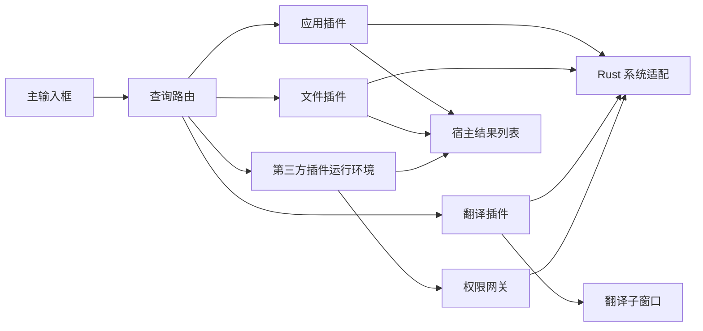

# 跨平台桌面启动器 MVP 需求设计

## 1. 文档信息

- 文档状态：已确认
- 目标版本：MVP
- 首发顺序：Windows 先行，macOS 紧随
- 技术路线：Tauri 2 + TypeScript + Rust

## 2. 产品概述

本项目是一款面向开发者和效率工具用户的键盘优先桌面启动器，产品形态类似 uTools 和 Alfred。程序常驻后台，用户通过全局快捷键唤起输入框，搜索并启动应用、查找文件、翻译文本，或通过关键词和命令调用本地插件。

MVP 不依赖账号或云端平台。除翻译服务外，核心能力均在本机完成。

## 3. 产品目标

1. 用户能够在不使用鼠标的情况下完成唤起、搜索、选择和执行。
2. 常驻状态下，唤起窗口后 1 秒内可以输入。
3. 内置插件覆盖应用启动、文件搜索和中英翻译三个高频场景。
4. 第三方开发者能够使用 JS/TS 开发并本地安装带 UI 的插件。
5. 插件没有直接系统权限，异常插件不能导致 Rust 核心进程退出。
6. Windows 版本先完成产品验证，再以相同行为交付 macOS 版本。

## 4. 目标用户

- 习惯通过键盘操作电脑的开发者和效率工具用户。
- 希望自行开发或安装本地插件的高级用户。
- MVP 不面向需要插件市场、账号同步和集中管理的企业用户。

## 5. MVP 范围

### 5.1 包含

- 全局快捷键和常驻桌面宿主。
- 单输入框、结果列表和全键盘操作。
- 应用启动与已运行窗口激活。
- 基于操作系统索引的文件名搜索。
- 使用用户自有有道凭据的中英翻译。
- JS/TS 插件 SDK。
- 本地 ZIP 插件安装和开发目录加载。
- 插件权限声明、运行时校验、启用、禁用和卸载。
- Windows 10/11 x64。
- macOS 13+ Intel 和 Apple Silicon。

### 5.2 不包含

- 插件市场、插件签名体系和插件自动更新。
- 主程序自动更新。
- 账号、云同步、遥测和推荐系统。
- Python 插件、Python sidecar 和平台原生二进制插件。
- 第三方插件后台常驻。
- 自建文件索引、文件内容搜索和阻塞式全盘遍历。
- 应用拼音匹配、错别字纠正和语义搜索。
- 翻译历史、收藏、朗读、文档翻译和离线翻译。

## 6. 核心交互

### 6.1 程序生命周期

- 程序保持单实例并常驻后台。
- Windows 默认快捷键为 `Alt+Space`。
- macOS 默认快捷键为 `Option+Space`。
- 快捷键可在设置中修改。
- 系统托盘菜单提供“打开设置”和“退出”。
- 开机启动可配置，默认关闭。

### 6.2 主窗口

- 快捷键唤起后，主窗口置顶且输入框自动获得焦点。
- 窗口由输入框和自适应高度的滚动结果列表组成。
- 空输入不展示推荐内容。
- 主窗口失去焦点或用户按 `Esc` 时隐藏。
- `Up`、`Down` 移动选择，`Enter` 执行当前项。
- 执行应用启动或文件定位后隐藏主窗口。
- 界面跟随系统明暗主题，不提供自定义主题。

### 6.3 查询路由

- 不以 `/` 开头的输入同时匹配应用名称、应用别名、插件名称和插件关键词。
- 普通查询按完全匹配、前缀匹配、包含匹配、字符顺序匹配和最近使用数据排序。
- 以 `/` 开头的输入只进入命令路由，不执行普通应用搜索。
- `/find <文件名>` 调用文件搜索插件。
- `/fy <文字>` 生成“翻译该内容”结果项，按 `Enter` 后打开翻译子窗口。
- 输入未知的 `/命令` 时展示可匹配的插件命令；没有匹配时显示空状态。
- 插件命令必须全局唯一；`/find` 和 `/fy` 为内置保留命令。
- 插件关键词可以重复，重复时按匹配分数和最近使用数据排序。

### 6.4 插件激活

- 普通查询匹配插件名称或关键词时，结果列表显示插件入口项。
- 选择 `list` 类型插件后进入该插件的列表模式，输入焦点保留在主输入框。
- 选择 `window` 类型插件后打开独立插件窗口。
- `/命令 参数` 可跳过插件入口选择，将参数直接传给插件。

## 7. 内置插件

### 7.1 应用启动与窗口激活

#### 数据来源

- Windows 扫描当前用户和所有用户的开始菜单应用入口。
- macOS 扫描 `/Applications`、`~/Applications` 和系统应用目录。
- 启动时建立轻量本地缓存。
- 应用目录发生变化或用户点击“重新扫描”时刷新缓存。
- 缓存保存应用名称、图标、启动标识、安装路径和用户别名。

#### 搜索与排序

- 搜索字段包括应用名称和用户自定义别名。
- 匹配忽略英文字母大小写。
- 支持前缀、包含和字符顺序匹配，例如“企业”或“微信”均可匹配“企业微信”。
- MVP 不支持拼音、错别字纠正和语义搜索。
- 应用结果最多返回 20 项。
- 排序依次参考完全匹配、前缀匹配、包含匹配、字符顺序匹配和最近使用数据。

#### 执行动作

- 目标应用存在可见窗口时，激活最近使用的窗口。
- 目标应用没有可见窗口时，正常启动应用。
- 多窗口场景不显示二级窗口选择器。
- 启动或激活失败时保留主窗口并显示错误信息。

### 7.2 文件搜索

#### 查询范围

- 仅按文件名搜索，不搜索文件内容。
- 仅返回文件，不返回文件夹。
- Windows 使用操作系统文件索引。
- macOS 使用 Spotlight。
- 不自行建立或维护文件索引。
- UI 明确说明结果可能不包含未被系统索引的目录。

#### 查询行为

- 输入变化后防抖 150ms。
- 新查询开始时取消上一条查询；无法取消的旧查询结果必须被忽略。
- 系统索引正常时持续返回结果，不等待全部结果完成后再渲染。
- 结果最多返回 100 项。
- 排序依次参考文件名完全匹配、前缀匹配、包含匹配和最近修改时间。
- 每项显示文件图标、文件名和完整路径。

#### 执行动作

- 按 `Enter` 后使用 Explorer 或 Finder 打开文件所在目录并选中文件。
- 系统索引服务不可用时显示平台对应的处理指引。
- 索引不可用时不降级为阻塞式全盘遍历。

### 7.3 翻译

#### 配置

- 默认服务商和接口地址为有道文本翻译 API。
- 客户端不内置开发者账号或密钥。
- 首次使用时要求用户填写 `App Key` 和 `App Secret`。
- 用户可以测试、修改或清除凭据。
- `App Secret` 保存在 Windows Credential Manager 或 macOS Keychain。
- 密钥不得写入普通配置、日志或插件目录。
- MVP 不支持其他翻译服务商。

#### 交互

- `/fy <文字>` 打开翻译子窗口并带入原文。
- 原文包含中文时默认翻译为英文，否则默认翻译为中文。
- 用户可以交换源语言和目标语言。
- 编辑原文后防抖 300ms 自动翻译。
- 新请求发出后，旧请求应取消；无法取消的旧结果必须被忽略。
- 用户可以复制译文。
- 翻译子窗口按 `Esc` 关闭并将焦点返回主输入框。

#### 错误处理

- 网络失败时保留原文并提供重试。
- 凭据错误时引导用户打开配置页。
- 接口额度不足和接口限流必须使用不同错误信息。
- 错误响应不得在 UI 或日志中暴露 `App Secret`。

## 8. 插件系统

### 8.1 定位

本项目的插件是运行时加载的 JS/TS 插件，不等同于需要随主程序编译的 Tauri Rust 插件。

三个内置插件遵守与第三方插件相同的输入、结果和动作协议。涉及系统权限的实现仍由 Rust 宿主提供。

### 8.2 插件包

插件包为 ZIP 文件，至少包含：

```text
plugin.zip
├── manifest.json
├── dist/
│   └── index.js
└── ui/                 # window 类型插件可选
    ├── index.html
    └── assets/
```

安装校验要求：

- 插件 ID 使用反向域名格式并且全局唯一。
- 清单、入口脚本和声明的 UI 文件必须存在。
- 压缩包最大 50 MiB，解压后最大 200 MiB。
- 拒绝绝对路径、父目录跳转、符号链接和重复覆盖路径。
- 拒绝平台原生二进制、Python 文件和安装后脚本。
- 命令冲突时拒绝安装，并显示冲突插件。
- 安装前展示插件来源、版本和权限；用户拒绝权限时取消安装。
- 无签名插件必须显示“本地未签名插件”提示。

### 8.3 插件清单

`manifest.json` 至少包含以下字段：

| 字段 | 含义 |
| --- | --- |
| `id` | 全局唯一插件 ID |
| `name` | 展示名称 |
| `version` | 插件版本 |
| `minHostVersion` | 最低宿主版本 |
| `entry` | 编译后的 JS 入口 |
| `mode` | `list` 或 `window` |
| `keywords` | 普通输入可匹配的关键词 |
| `commands` | 唯一的斜杠命令列表 |
| `permissions` | 权限声明 |
| `ui` | `window` 模式的 UI 入口，可选 |

MVP 不允许插件清单声明后台任务、原生依赖或安装脚本。

### 8.4 UI 模式

#### `list`

- 插件入口脚本接收查询、请求 ID 和宿主信息。
- 插件返回标准 `ResultItem` 数组，由宿主统一渲染。
- 结果项包含稳定 ID、标题、可选副标题、可选图标和主动作。
- 插件不得向结果列表注入 HTML。
- 查询逻辑在可终止的 Worker 中按需执行。

#### `window`

- 插件 UI 在独立低权限 WebView 中运行。
- WebView 标签必须与已安装插件 ID 绑定。
- 插件 UI 不获得通用 Tauri API。
- 插件 UI 只能通过插件 RPC 网关请求已声明并获准的能力。
- 插件窗口关闭、崩溃或无响应不得导致 Rust 核心进程退出。

### 8.5 权限

MVP 支持以下第三方插件权限：

- `network`：仅允许访问清单列出的 HTTPS 域名。
- `clipboard:read`：读取剪贴板。
- `clipboard:write`：写入剪贴板。
- `filesystem:read`：仅读取用户在运行时选择并授权的目录。
- `external:open`：使用系统默认程序打开 URL 或文件。

明确禁止：

- 任意 Shell 或进程启动。
- 任意文件系统读写。
- 未限定域名的网络访问。
- 直接读取系统凭据库。
- 动态下载并执行代码。
- 直接调用未通过权限网关的 Tauri 命令。

### 8.6 生命周期和容错

- 插件仅在命中关键词、命令或用户选择入口后加载。
- 第三方插件不得在后台常驻。
- 宿主为每次查询生成请求 ID，过期响应不得覆盖新结果。
- 单次查询超过 5 秒后宿主终止对应 Worker，并在 UI 中提供重新加载操作。
- 同一次主程序运行期间连续失败 3 次的插件自动禁用，直到用户手动重新启用。
- 插件管理页支持安装、启用、禁用、卸载和本地包覆盖升级。
- 开发模式允许用户显式加载本地目录；开发模式默认关闭。

## 9. 系统架构

### 9.1 组件职责

#### Rust 核心进程

- 单实例和应用生命周期。
- 全局快捷键、窗口和托盘管理。
- 设置持久化和系统凭据存储。
- Windows/macOS 系统能力适配。
- 插件包安装与校验。
- 插件注册、命令路由和权限网关。
- 翻译请求签名和网络调用。

#### TypeScript 主 WebView

- 主输入框和结果列表。
- 键盘导航和状态展示。
- 设置页和插件管理页。
- 标准列表结果渲染。
- 与 Rust 核心进程进行受限 IPC。

#### 插件运行环境

- `list` 插件逻辑在可终止 Worker 中运行。
- `window` 插件 UI 在独立低权限 WebView 中运行。
- 插件不能直接访问系统能力。
- 所有特权操作经过插件 ID、窗口标签、清单权限和用户授权四重校验。

### 9.2 数据流



### 9.3 Tauri 权限边界

- 主 WebView 仅获得实现宿主 UI 所需的能力。
- 插件 WebView 不继承主 WebView 的能力。
- 自定义 Tauri 命令默认不向所有 WebView 开放。
- 插件只允许调用单一插件 RPC 网关；网关不得暴露通用命令转发能力。
- 网络、文件和剪贴板参数必须由 Rust 核心进程重新校验，不能信任前端参数。

## 10. 设置与本地数据

### 10.1 设置页

- 全局快捷键。
- 开机启动。
- 应用别名和重新扫描。
- 有道翻译凭据和连接测试。
- 插件安装、权限、启用状态和卸载。
- 开发模式和本地目录加载。

### 10.2 存储

- 普通设置、应用缓存和最近使用排序数据保存在系统应用数据目录。
- 数据量不足以要求数据库，MVP 使用结构化本地文件。
- 设置写入必须采用临时文件加原子替换，避免异常退出导致配置损坏。
- 翻译密钥只存系统凭据库。
- 插件存放在独立插件目录，不得写入程序安装目录。

### 10.3 隐私

- 除翻译 API 外，不向外部服务发送用户数据。
- 日志不得记录翻译原文、搜索词、剪贴板内容或完整文件路径。
- 日志必须对令牌、密钥和请求签名进行脱敏。
- MVP 不收集遥测。

## 11. 非功能需求

### 11.1 性能

- 常驻状态下，从全局快捷键触发到输入框可交互，P95 不超过 1 秒。
- 应用缓存搜索从输入变化到结果更新，P95 不超过 100ms。
- 系统索引正常时，文件搜索首批结果 P95 不超过 1 秒。
- 用户快速连续输入时，旧查询结果不得覆盖新查询结果。

### 11.2 稳定性

- 主程序保持单实例。
- 第三方插件异常、超时或 UI 关闭不得导致 Rust 核心进程退出。
- 配置写入中断后，程序能够使用上一次有效配置启动。
- 快捷键冲突、索引不可用、插件损坏和权限拒绝均提供可恢复提示。

### 11.3 安全

- Windows 安装包必须签名。
- macOS 安装包必须签名并完成 Apple 公证。
- 插件包解压必须防止 Zip Slip 和压缩炸弹。
- 插件 WebView 使用最小能力配置和内容安全策略。
- 所有插件 RPC 均验证调用来源、插件 ID、权限和参数范围。
- 翻译密钥不得进入前端状态、插件上下文或日志。

### 11.4 可访问性

- 所有核心流程可仅通过键盘完成。
- 当前选中项具有明确视觉状态和无障碍选中状态。
- 图标按钮提供可访问名称和悬停提示。
- 错误状态不能仅依赖颜色表达。

## 12. 平台要求

| 平台 | 最低版本 | CPU | 文件搜索 | 应用来源 |
| --- | --- | --- | --- | --- |
| Windows | Windows 10 | x64 | 系统文件索引 | 当前用户和所有用户开始菜单 |
| macOS | macOS 13 | Intel、Apple Silicon | Spotlight | 系统、全局和用户 Applications 目录 |

Windows 版本先完成验收。macOS 版本复用相同插件协议、UI 行为和验收用例，只替换系统能力适配。

## 13. 错误处理

| 场景 | 预期行为 |
| --- | --- |
| 全局快捷键冲突 | 程序继续运行，提示用户修改快捷键 |
| 应用启动或激活失败 | 保留主窗口并显示目标应用和失败原因 |
| 系统索引不可用 | 显示平台处理指引，不执行全盘遍历 |
| 翻译凭据缺失 | 打开翻译配置页 |
| 翻译网络失败 | 保留原文并提供重试 |
| 插件包损坏 | 拒绝安装，不保留半安装目录 |
| 插件申请未声明权限 | 拒绝请求并记录脱敏错误 |
| 插件查询超过 5 秒 | 终止 Worker，保留宿主 UI 并提供重新加载 |
| 本地配置损坏 | 使用上一份有效配置并提示用户 |

## 14. 验收标准

### 14.1 主程序

- 安装后只能运行一个主实例。
- 默认全局快捷键能显示主窗口并聚焦输入框。
- `Up`、`Down`、`Enter` 和 `Esc` 行为符合第 6 节。
- 修改快捷键后无需重新安装即可生效。

### 14.2 应用插件

- 输入“企业”或“微信”可以匹配已安装的“企业微信”。
- 目标未运行时按 `Enter` 能启动应用。
- 目标已运行时按 `Enter` 能激活最近使用的可见窗口。
- 启动失败时主窗口不隐藏。

### 14.3 文件插件

- `/find <文件名>` 只返回系统索引中的文件。
- 快速修改查询时不会出现旧结果覆盖新结果。
- 按 `Enter` 后文件管理器打开所在目录并选中文件。
- 索引不可用时不会开始阻塞式磁盘遍历。

### 14.4 翻译插件

- 未配置凭据时 `/fy <文字>` 引导用户配置。
- 中文默认翻译为英文，非中文默认翻译为中文。
- 用户可以交换语言并复制译文。
- 清除凭据后系统凭据库中不再保留该密钥。

### 14.5 第三方插件

- 用户可以安装、启用、禁用和卸载合法本地插件包。
- 路径跳转、超出大小限制或包含原生二进制的插件包被拒绝。
- 示例 `list` 插件能返回并执行标准结果项。
- 示例 `window` 插件能打开独立 UI。
- 未声明权限的系统调用被拒绝。
- 插件超时或崩溃不会退出 Rust 核心进程。

### 14.6 跨平台

- Windows 10/11 x64 完成全部验收用例。
- macOS 13+ Intel 和 Apple Silicon 分别完成全部验收用例。
- Windows 和 macOS 使用相同插件包时，纯 JS/TS 功能行为一致。

## 15. 测试要求

- 单元测试覆盖命令解析、模糊排序、请求过期处理和权限判断。
- 安全测试覆盖绝对路径、父目录跳转、符号链接、重复路径和压缩包大小限制。
- 插件测试覆盖超时、异常、非法 RPC 和禁用后的调用。
- Rust 系统适配通过接口替身测试成功、空结果和失败场景。
- 翻译请求使用本地模拟服务验证签名参数、错误分类和密钥脱敏。
- Windows 和 macOS 各执行一次完整键盘流程自动化测试。
- Windows 10/11、macOS Intel、macOS Apple Silicon 各执行安装和签名验证。

## 16. 交付顺序

1. Windows 桌面宿主、输入框、快捷键和应用插件。
2. Windows 文件搜索和翻译插件。
3. 插件协议、权限网关、本地安装和两个示例插件。
4. Windows 完整验收和签名安装包。
5. macOS 系统适配、Intel/Apple Silicon 构建和完整验收。
6. macOS 签名、公证和安装包。

## 17. 已确认决策

- 产品面向开发者工具用户。
- 第三方插件仅支持 JS/TS。
- 使用 Tauri 2 + TypeScript + Rust，不引入 Python sidecar。
- 文件搜索优先速度，依赖操作系统索引。
- 应用搜索只覆盖已安装桌面应用。
- 翻译采用中英自动互译。
- 翻译凭据由用户自行配置，不内置默认密钥，不建设代理服务。
- 第三方插件采用沙箱和权限声明。
- 插件通过本地 ZIP 安装，不建设插件市场。
- Windows 先行，macOS 紧随。
- MVP 优先快捷、稳定和全键盘操作。

## 18. 参考资料

- [Tauri 进程模型](https://v2.tauri.app/concept/process-model/)
- [Tauri Capabilities](https://v2.tauri.app/security/capabilities/)
- [Tauri Runtime Authority](https://v2.tauri.app/security/runtime-authority/)
- [有道文本翻译 API](https://ai.youdao.com/DOCSIRMA/)
